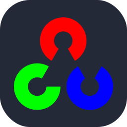

I am currently interning at SUSTech [RCIT]((https://cse.sustech.edu.cn/en/research/labView/id/161)) (Research Center for Intelligent Transportation), working on data closed-up, lidar detection algorithms in autonomous driving. I am a current undergraduate student at [SUSTech](https://www.sustech.edu.cn/en/) (Southern University of Science and Technology), majoring in Computer Science and Engineering. I have some learning and engineering experience in machine learning and deep learning.

## Education
- B.Eng. in Computer Science and Engineering, Southern University of Science and Technology, 2025 (expected)

## Skills
**Research Interests:**

**Programming Languages:** 

| Python | Java | C++ | Shell | C# | GoDot | Lua | NeoVim |
|:------:|:---:|:----:|:-----:|:--:|:-----:|:---:|:---:|
| |  |  | |  |  |   |   |
| 3 years | 3 years | 2 years | 2 years | 1 year | 1 year | 1 year | 1 year |

**Tools and Framework:**

| Linux | Docker | Latex | Pytorch | ROS | OpenCV | Unity3D | Git |
|:----:|:----:|:----:|:----:|:----:|:----:|:----:|:----:|
| |   |  |  |    |   | |  |
