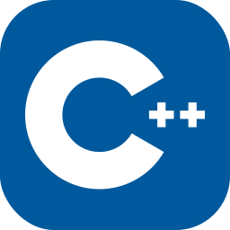
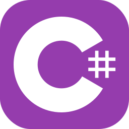
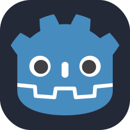
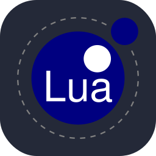
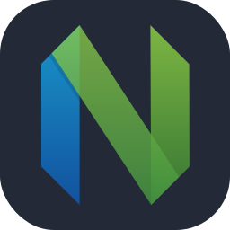
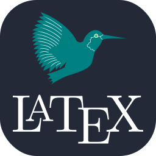
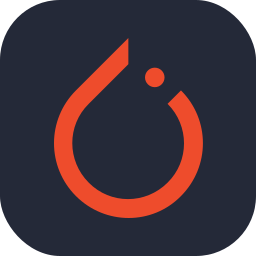

I am currently interning at SUSTech [RCIT]((https://cse.sustech.edu.cn/en/research/labView/id/161)) (Research Center for Intelligent Transportation), working on data closed-up, lidar detection algorithms in autonomous driving. I am a current undergraduate student at [SUSTech](https://www.sustech.edu.cn/en/) (Southern University of Science and Technology), majoring in Computer Science and Engineering. I have some learning and engineering experience in machine learning and deep learning.

In the field of autonomous driving, I am familiar with some frameworks, especially related to point cloud perception algorithms, such as [OpenPCDet](https://github.com/open-mmlab/OpenPCDet) and [mmDetection3D](https://github.com/open-mmlab/mmdetection3d). in the field of simulation, I am able to work with [Carla](https://github.com/carla-simulator/carla) and can use it in conjunction with [Apollo](https://github.com/apolloconfig/apollo). In deep learning training, I am able to operate [Slurm](https://github.com/SchedMD/slurm) and [Singularity](https://github.com/apptainer/singularity) skillfully.

## Education
- B.Eng. in Computer Science and Engineering, Southern University of Science and Technology, 2025 (expected)

## Skills
<!-- 设置style，使得表格等宽 -->

**Research & Develop Interests:**
<!-- 

 -->

- **Autonomous Driving**, **Data closed-up**, **Lidar Detection Alogrithm**, CARLA, Deep Learning, Computer Vision, Machine Learning
- ARM Embedded System, Robotics, SLAM, Unity3D Game, STM32 Embedded System, Jetson, Issac

**Programming Languages:** 

| Python | Java | C++ | Shell | C# | GoDot | Lua | NeoVim |
|:------:|:---:|:----:|:-----:|:--:|:-----:|:---:|:---:|
| |  |  | |  |  |   |   |
| 3 years | 3 years | 2 years | 2 years | 1 year | 1 year | 1 year | 1 year |

**Tools and Framework:**

| Linux | Docker | Latex | Git | Pytorch | ROS | OpenCV | Unity3D | 
|:----:|:----:|:----:|:----:|:----:|:----:|:----:|:----:|
| |   |  | |  |    |   | | 
| 3 years | 2 years | 2 years | 2 years | 2 year  | 1 year | 1 year | 1 year | 

