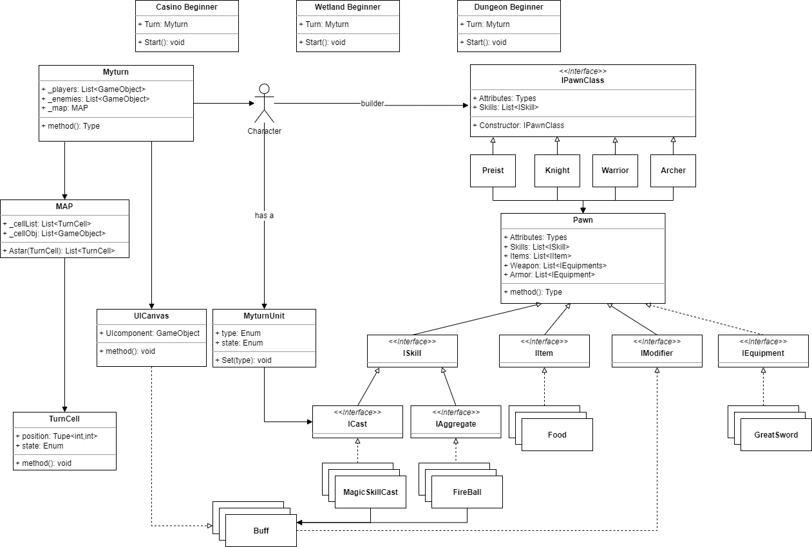
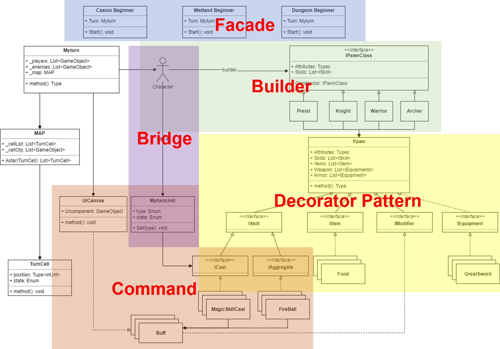
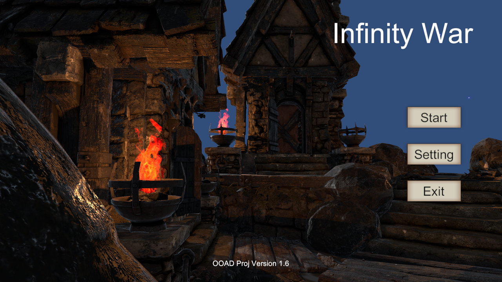

An unity 3D game written by C#, it is a local double players game. 

# Unity War Chess Game

You can find the source code of Unity War Chess Game on my [GitHub](https://github.com/Kazawaryu/Unity_Warchess_Game) repository.

An unity 3D game written by C#, it is a local double players game. The game contains skill system, level system, item system and equipment system. The project used several **Object Oriented Analysis Designs** to be maintained easily. 

### 1.	UML Class Diagram

Basically, I divided all classes into several part due to it's function but not object orientation, cause the class diagram is a little bit complex. The full class diagram is as follow. Some unity components such as used to control UI canvas and input modules are not  shown in the diagram.

The project uses several Object Oriented Analysis Designs(facade, builder, bridge, decorator pattern, command). Here comes the details.

### 2.	Game Screen

Main frame when the game starts.

Battle frame in map-wetland, with dynamic water and leaves effects, detailed information feedback and good landscape.

Battel frame in map-dungeon, a archer is trying to use skill-apex arrow but the enemy is out of skill range, therefore it couldn't be select.

More details to seen at floder Pics.